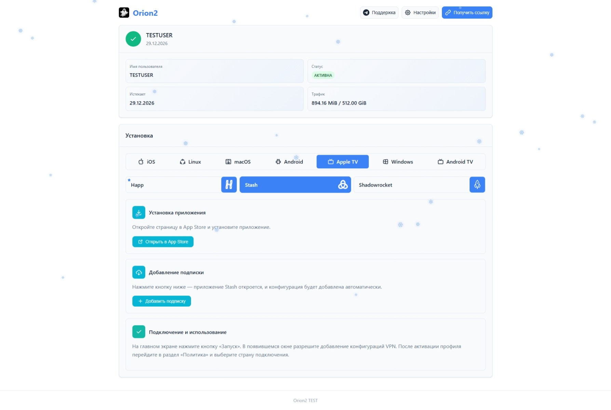
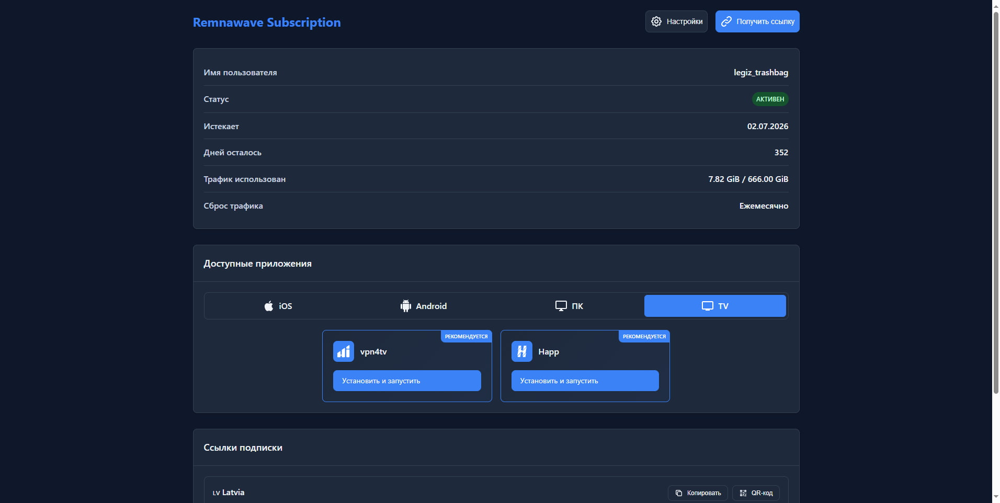
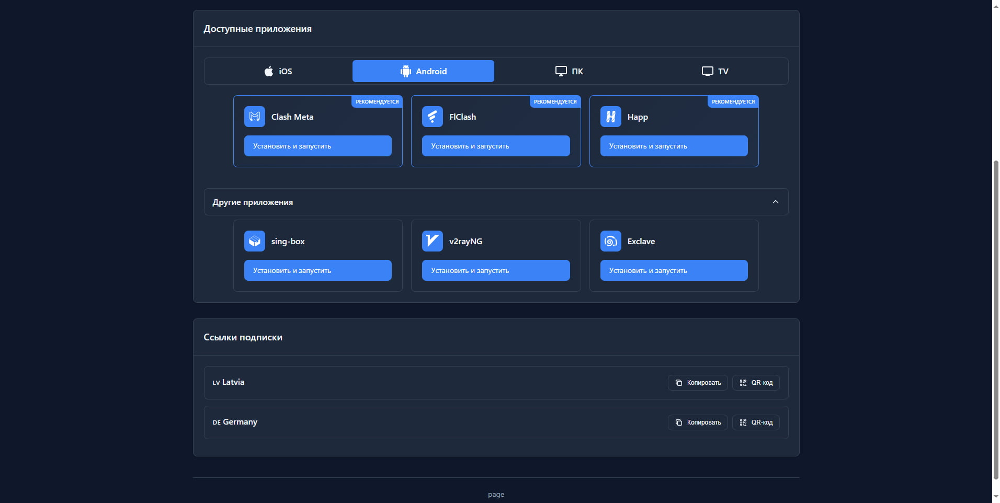
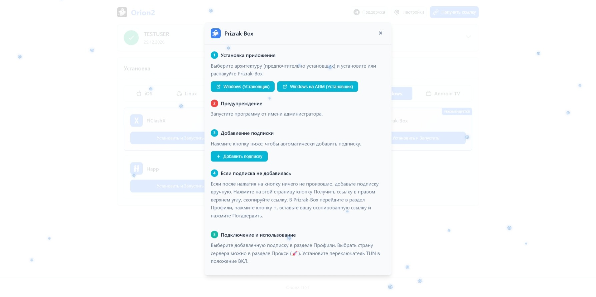
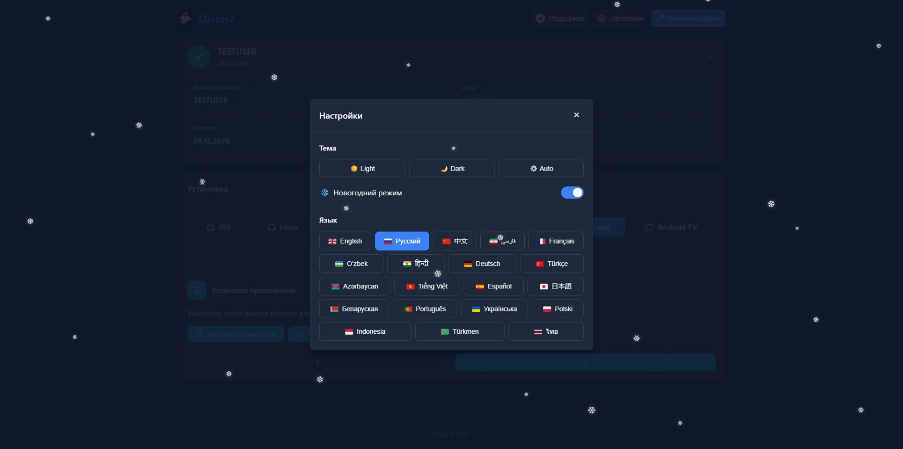
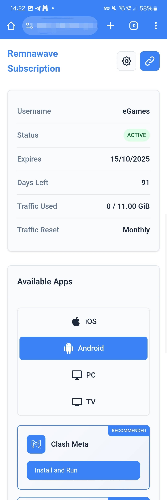

[English Version](README_en.md) | [نسخه فارسی](README_fa.md)

[Демонстрационная страница](https://legiz-ru.github.io/Orion)

# Orion

Современная, быстрая и адаптивная страница подписки для панели Remnawave. Она создана с нуля, чтобы обеспечить лучший пользовательский опыт, высокую производительность и простоту настройки.

## Ключевые особенности

*   **Современный и адаптивный дизайн:** Чистый, интуитивно понятный интерфейс, который отлично выглядит и работает на любых устройствах, от настольных ПК до смартфонов.

*   **Поддержка тем:** Автоматическое или ручное переключение между светлой, темной и системной темами для комфорта глаз в любое время суток.

*   **Гибкая настройка приложений:** Полная кастомизация списка приложений, поддержка "рекомендуемых" приложений и многошаговые инструкции по установке через [настраиваемый файл `app-config.json`](https://remna.st/docs/install/remnawave-subscription-page#custom-app-configjson-custom-apps).
    *   **Кастомные группы:** Возможность добавлять дополнительные группы в раздел приложений через файл интеграции, [например `секцию TV`](https://github.com/legiz-ru/my-remnawave/blob/main/sub-page/multiapp/app-config.json).

*   **Копирование ссылок и QR-коды:** Удобное копирование индивидуальных ссылок (`vless://`, `trojan://`) и основной ссылки-подписки в один клик. Для каждой ссылки можно сгенерировать адаптивный QR-код.

*   **Многоязычная поддержка:** Страница доступна на **русском, английском и фарси**. Язык определяется автоматически на основе настроек браузера пользователя, с возможностью ручного переключения.

*   **Интеграция с Telegram Mini App:** Возможность использовать страницу подписки как Telegram Mini App в вашем боте.

## Скриншоты

<div align="center">
  
  
  
  
  
</div>

<div align="center">
  
</div>

## Установка

1.  **Загрузка файла страницы:**
    Скачайте файл `index.html` в ту же папку, где находится ваш `docker-compose.yml`, используя `curl`:

    ```bash
    curl -o index.html https://raw.githubusercontent.com/legiz-ru/Orion/main/index.html
    ```

2.  **Настройка Docker Compose:**
    Пропишите путь к скачанному `index.html` в вашем `docker-compose.yml` через проброс `volumes` в контейнер `remnawave-subscription-page`.

    Пример для стандартной установки:

    ```yaml
    services:
      remnawave-subscription-page:
        image: remnawave/subscription-page:latest
        volumes:
          - ./index.html:/opt/app/frontend/index.html
    ```

    Если вы планируете использовать [кастомный список приложений](https://remna.st/docs/install/remnawave-subscription-page#custom-app-configjson-custom-apps) (`app-config.json`), добавьте соответствующий `volume`:

    ```yaml
    services:
      remnawave-subscription-page:
        image: remnawave/subscription-page:latest
        volumes:
          - ./index.html:/opt/app/frontend/index.html
          - ./app-config.json:/opt/app/frontend/assets/app-config.json
    ```

3.  **Перезапуск контейнера:**
    Для применения изменений перезапустите контейнер Docker:

    ```bash
    docker compose down remnawave-subscription-page && docker compose up -d remnawave-subscription-page
    ```

## Связь

*   [Telegram-канал](https://t.me/legiz_trashbag)

## Поддержка проекта

Если вам нравится этот проект и вы хотите поддержать его развитие, вы можете сделать пожертвование:

*   [Tribute on Telegram](https://t.me/tribute/app?startapp=drzu)
*   TON USDT: `UQAGQTQZYCx5TWj5cmTLpo7164PFsXqZZJ6t6x88n7sHW9gU`