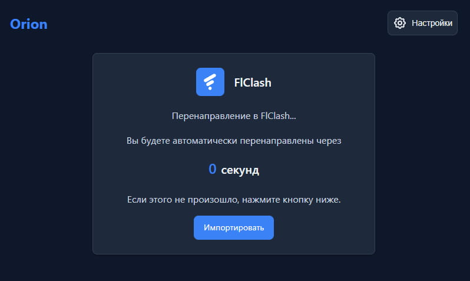

[Russian Version](README.md) | [English Version](README_en.md) | [中文版本](README_zh.md)

[صفحه‌ی نمایشی](https://legiz-ru.github.io/Orion)

# Orion

یک صفحه اشتراک مدرن، سریع و واکنش‌گرا برای پنل پروکسی Remnawave. این صفحه از ابتدا برای ارائه تجربه کاربری بهتر، عملکرد بالا و سفارشی‌سازی آسان ساخته شده است.

## ویژگی‌های کلیدی

*   **طراحی مدرن و واکنش‌گرا:** رابط کاربری تمیز و بصری که بر روی هر دستگاهی، از دسکتاپ تا گوشی‌های هوشمند، عالی به نظر می‌رسد و کار می‌کند.

*   **پشتیبانی از تم‌ها:** جابجایی خودکار یا دستی بین تم‌های روشن، تاریک و سیستمی برای راحتی چشم در هر زمان از روز.

*   **پیکربندی انعطاف‌پذیر برنامه‌ها:** سفارشی‌سازی کامل لیست برنامه‌ها، پشتیبانی از برنامه‌های "ویژه" و راهنماهای نصب چند مرحله‌ای از طریق [فایل قابل تنظیم `app-config.json`](https://remna.st/docs/install/remnawave-subscription-page#custom-app-configjson-custom-apps).
    *   **گروه‌های سفارشی:** قابلیت افزودن گروه‌های اضافی به بخش برنامه‌ها از طریق فایل یکپارچه‌سازی، [به عنوان مثال `بخش تلویزیون`](https://github.com/legiz-ru/my-remnawave/blob/main/sub-page/multiapp/app-config.json).

*   **پشتیبانی از برندینگ:** پیکربندی لوگو و لینک پشتیبانی از طریق پارامترهای `logoUrl` و `supportUrl` در تنظیمات `app-config.json` برای شخصی‌سازی صفحه.

*   **کپی کردن لینک‌ها و کدهای QR:** کپی کردن آسان لینک‌های فردی (`vless://`, `trojan://`) و لینک اشتراک اصلی با یک کلیک. برای هر لینک می‌توان یک کد QR تطبیق‌پذیر تولید کرد.

*   **پشتیبانی چندزبانه:** صفحه به زبان‌های **روسی، انگلیسی، ازبکی، ترکی، فارسی و چینی** در دسترس است. زبان بر اساس تنظیمات مرورگر کاربر به‌صورت خودکار تشخیص داده می‌شود و امکان تغییر دستی نیز وجود دارد.

*   **پشتیبانی از remnawave-json:** امکان یکپارچگی صفحه اشتراک در https://github.com/Jolymmiels/remnawave-json (فایل تطبیق‌یافته index.html در پوشه remnawave-json قرار دارد).

*   **ادغام با Telegram Mini App:** قابلیت استفاده از صفحه اشتراک به عنوان یک اپلیکیشن کوچک تلگرام در ربات شما.
    *   **صفحه ریدایرکت (پیمایش):** امکان استفاده از صفحه ریدایرکت اختصاصی یا خارجی (مناسب برای Telegram Mini App، به عنوان مثال در سبک Orion — [دمو](https://legiz-ru.github.io/Orion/redirect-page/?redirect_to=)، سلف هاست از [Orion redirect-page](https://github.com/legiz-ru/Orion/blob/main/docs/redirect-page/index.html)).


## اسکرین‌شات‌ها

<div align="center">
  
  
  
  
  
</div>

<div align="center">
  
</div>

<div align="center">
  
</div>

## نصب Remnawave

۱. **دانلود فایل صفحه:**
   فایل `index.html` را با استفاده از `curl` در همان پوشه‌ای که `docker-compose.yml` شما قرار دارد، دانلود کنید:

    ```bash
    curl -o index.html https://raw.githubusercontent.com/legiz-ru/Orion/main/index.html
    ```

۲. **پیکربندی Docker Compose:**
   در فایل `docker-compose.yml` خود، مسیر فایل `index.html` دانلود شده را با استفاده از `volumes` به کانتینر `remnawave-subscription-page` متصل کنید.

   مثال برای نصب استاندارد:

    ```yaml
    services:
      remnawave-subscription-page:
        image: remnawave/subscription-page:latest
        volumes:
          - ./index.html:/opt/app/frontend/index.html
    ```

   اگر قصد دارید از [لیست برنامه‌های سفارشی](https://remna.st/docs/install/remnawave-subscription-page#custom-app-configjson-custom-apps) (`app-config.json`) استفاده کنید، `volume` مربوطه را اضافه کنید:

    ```yaml
    services:
      remnawave-subscription-page:
        image: remnawave/subscription-page:latest
        volumes:
          - ./index.html:/opt/app/frontend/index.html
          - ./app-config.json:/opt/app/frontend/assets/app-config.json
    ```

۳.  **(اختیاری) تنظیم صفحه ریدایرکت برای پیمایش**  
    برای ادغام با Telegram Mini App یا منطق پیمایش سفارشی، آدرس صفحه ریدایرکت خود را در `index.html` قرار دهید:
    ```js
    const redirect_link = 'https://legiz-ru.github.io/Orion/redirect-page/?redirect_to=';
    ```
    یا نسخه سلف هاست خودتان را استفاده کنید. مثلاً: [Orion redirect-page](https://github.com/legiz-ru/Orion/blob/main/docs/redirect-page/index.html) یا [redirect-page از maposia](https://github.com/maposia/redirect-page/).

۴.  **راه‌اندازی مجدد کانتینر:**  
   برای اعمال تغییرات، کانتینر Docker را مجدداً راه‌اندازی کنید:

    ```bash
    docker compose down remnawave-subscription-page && docker compose up -d remnawave-subscription-page
    ```

## نصب vpnbot

اسکریپت نصب را روی سرور vpnbot خود اجرا کنید:

```bash
bash <(curl -s https://raw.githubusercontent.com/legiz-ru/Orion/refs/heads/main/vpnbot/install.sh)
```

## نصب برای marzban

**نصب خودکار:**  
طبق توضیحات [marz-sub](https://github.com/legiz-ru/marz-sub/blob/main/README.md) اسکریپت نصب خودکار را اجرا کنید.

**نصب دستی:**  
<details>
<summary>راهنمای گام به گام</summary>

1. دانلود فایل صفحه:
   ```bash
   sudo wget -N -P /var/lib/marzban/templates/subscription/ https://raw.githubusercontent.com/legiz-ru/Orion/main/marzban/index.html
   ```

2. مسیر قالب صفحه اشتراک را در `.env` مارزبان تنظیم کنید:
   ```bash
   echo 'CUSTOM_TEMPLATES_DIRECTORY="/var/lib/marzban/templates/"' | sudo tee -a /opt/marzban/.env
   echo 'SUBSCRIPTION_PAGE_TEMPLATE="subscription/index.html"' | sudo tee -a /opt/marzban/.env
   ```

   یا فایل `.env` را به صورت دستی ویرایش کنید:
   ```
   CUSTOM_TEMPLATES_DIRECTORY="/var/lib/marzban/templates/"
   SUBSCRIPTION_PAGE_TEMPLATE="subscription/index.html"
   ```

3. **مقادیر `<%= metaTitle %>` و `<%= metaDescription %>` را در تمام بخش‌های فایل `index.html` با مقادیر دلخواه خود جایگزین کنید.**

4. مارزبان را ریستارت کنید:
   ```bash
   marzban restart
   ```
</details>

## ارتباط

*   [کانال تلگرام](https://t.me/legiz_trashbag)

## حمایت از پروژه

اگر از این پروژه لذت می‌برید و می‌خواهید از توسعه آن حمایت کنید، می‌توانید کمک مالی کنید:

*   [Tribute on Telegram](https://t.me/tribute/app?startapp=drzu)
*   TON USDT: `UQAGQTQZYCx5TWj5cmTLpo7164PFsXqZZJ6t6x88n7sHW9gU`